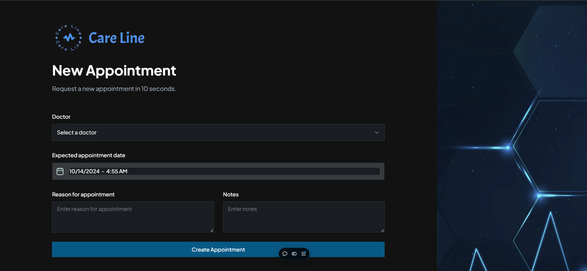
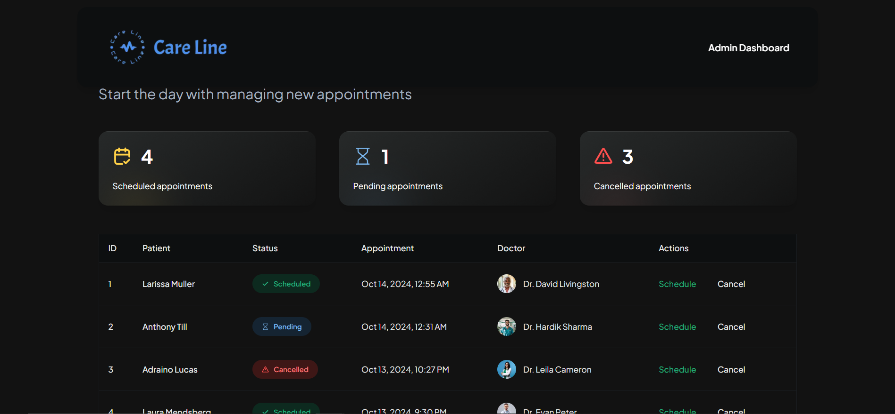
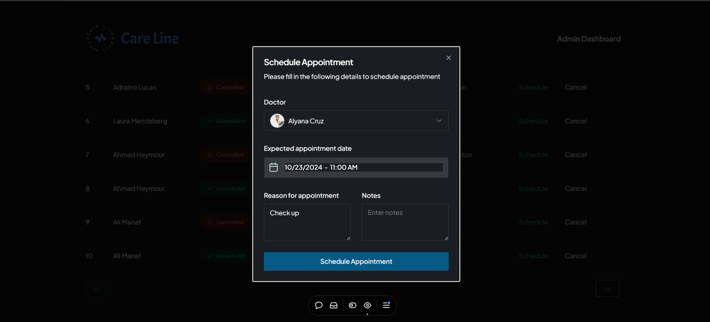

# _Healthcare Management System_

Care Line is a user-friendly healthcare management system designed to streamline patient registration, appointment scheduling, and notifications for clinics and healthcare providers. With its simple yet powerful features, it enhances day-to-day healthcare operations.

---

### `🚀 Features`:
- >**Patient Registration:** Easy-to-use form to register and manage patient details.
- >**Appointment Scheduling:** Schedule, cancel, or modify appointments seamlessly.
- >**Real-time SMS Notifications:** Patients get instant SMS updates for appointments via **Twilio**.
- >**Error Tracking:** **Sentry** helps monitor and track errors in real-time, ensuring smooth performance.
- >**Shadcn UI Components:** Sleek, reusable components from **Shadcn** make the UI clean and responsive.

---

### `🛠 Tech Stack`:
- >**Frontend:** Next.js, TypeScript, Tailwind CSS, Shadcn UI
- >**Backend:** Next.js, Appwrite (Authentication & Database)
- >**Notifications:** Twilio (SMS alerts for appointment updates)
- >**Error Monitoring:** Sentry
- >**Deployment:** Vercel

---

### `🔗 Live Demo`

Check out the live demo here: [Care Line Live](https://care-line.vercel.app/)

---

### `📲 How It Works`:

- >**Patient Sign In & Registration:** Patients can sign in, register, and securely manage their details.
- >**Appointment Scheduling:** Patients can schedule appointments, while admins can manage, cancel, or modify appointments.
- >**Real-time SMS Notifications:** Patients receive instant SMS updates for appointment confirmations or cancellations using **Twilio**.
- >**Admin Dashboard:** Admins have full control of scheduling and cancellations through an intuitive dashboard.
- >**Error Tracking:** **Sentry** is integrated for monitoring and tracking errors to ensure smooth and reliable performance.
- >**Shadcn UI Components:** Utilizes sleek and responsive **Shadcn** components to provide a smooth and consistent user interface.^

---

## `🖼 Screenshots` 

   
 

---

## `📄 License`

